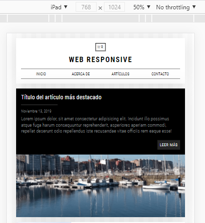

# Ejemplo de una web responsive

Ejemplo de cómo adaptar una web a forma responsive para que sea vea en smartphones mediante media queries

<h2>Pasos:</h2>
<ul>
    <ol>1 - Realizar la web sin versión responsive</ol>
    <ol>2 - Añadir tamaño de la fuente en el body en CSS</ol>
    <ol>3 - Transformar medidas px a em o rem donde sea necesario</ol>
    <ol>4 - Añadir los media queries con las medidas que queramos</ol>
    <ol>5 - Moficar en los media queries lo que necesitemos</ol>
</ul>